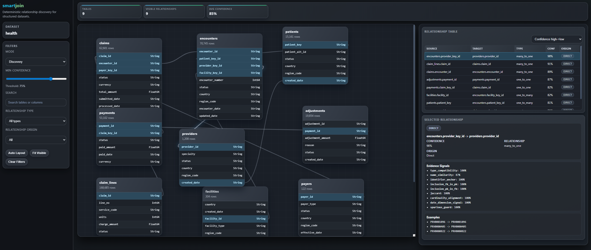

<p align="center">
  
</p>

# smartjoin: data relationship discovery in seconds

[](https://github.com/tbrus/smartjoin)
[](https://pypi.org/project/smartjoin/)
[](https://github.com/pre-commit/pre-commit)
[](https://github.com/psf/black)

Stop guessing how your tables connect - **smartjoin automatically discovers relationships between structured datasets** — no schema, no docs, no manual SQL detective work.

When working with unfamiliar datasets, one of the hardest problems is understanding how files relate to each other.

smartjoin helps by **scanning** structured datasets, **identifying candidate relationships**, producing **explainable outputs** instead of opaque guesses and giving you an **explorer to inspect and review the results**.


## Quickstart

### Installation

```bash
pip install smartjoin
```

### Run
```bash
smartjoin run <path> <out_dir>
```
This analyzes the structured datasets in `<path>` and writes results to `<out_dir>`.

### Generate test datasets

To explore how smartjoin works, you can generate synthethic test datasets:

```bash
smartjoin generate-test-datasets --output-dir <output-dir>
```

## Explorer

In addition to the output files, smartjoin generates an interactive HTML-based explorer that helps you inspect detected relationships visually.

<p align="center">
  
</p>


## Limitations

smartjoin identifies candidate relationships across structured datasets. It **does not** guarantee semantic correctness.

Please keep in mind:

- inferred relationships should be reviewed before being relied on downstream
- domain-specific meaning may still require human interpretation
- output quality depends on the quality, consistency, and structure of the input data
- the tool is intended for structured dataset analysis, not as a general-purpose data processing platform

Currently supported input formats include: `.csv`, `.xlsx`, `.json`, `.parquet`.

## Roadmap

Future development may include:

- stronger semantic matching across columns and tables
- optional AI-assisted reasoning and scoring
- improved explorer and debugging capabilities
- broader support for real-world edge cases and heterogeneous datasets

## Contributing

See [CONTRIBUTING.md](CONTRIBUTING.md).


## License

Licensed under the [MIT License](LICENSE)